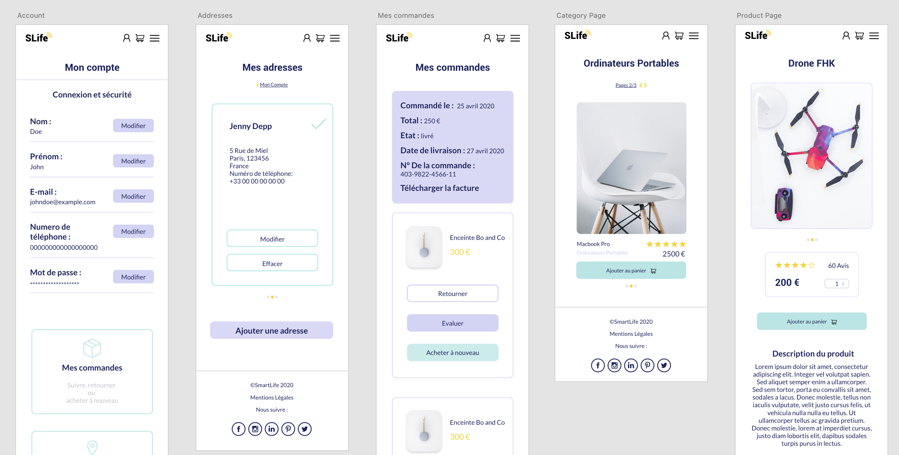
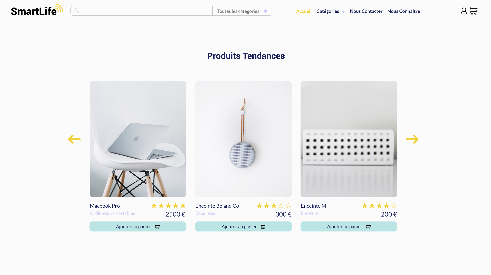
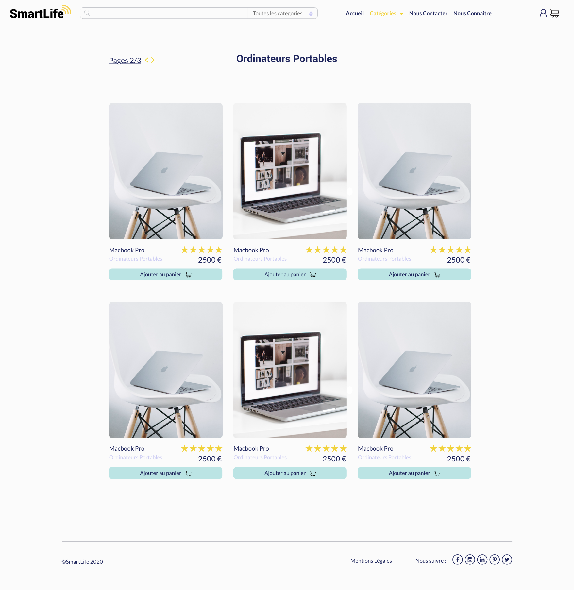
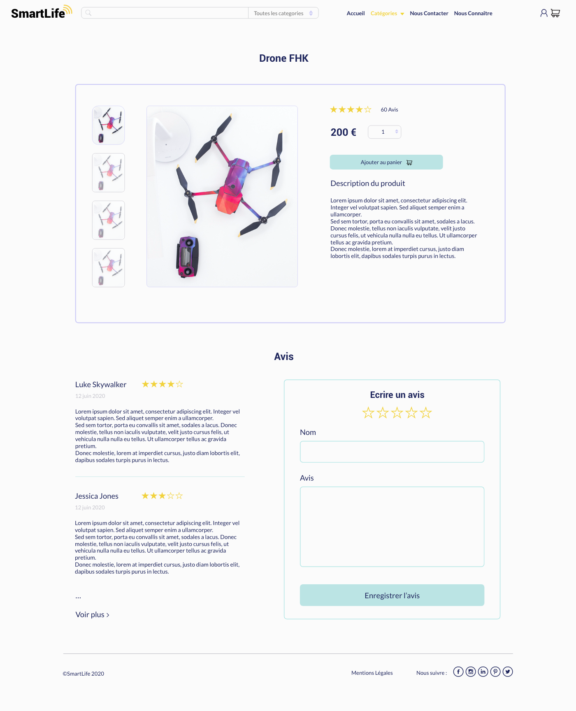
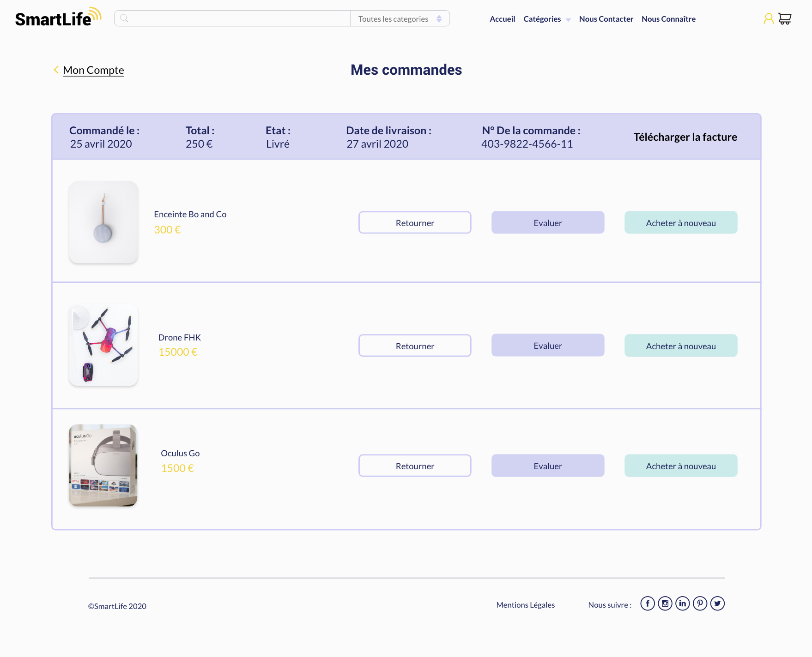
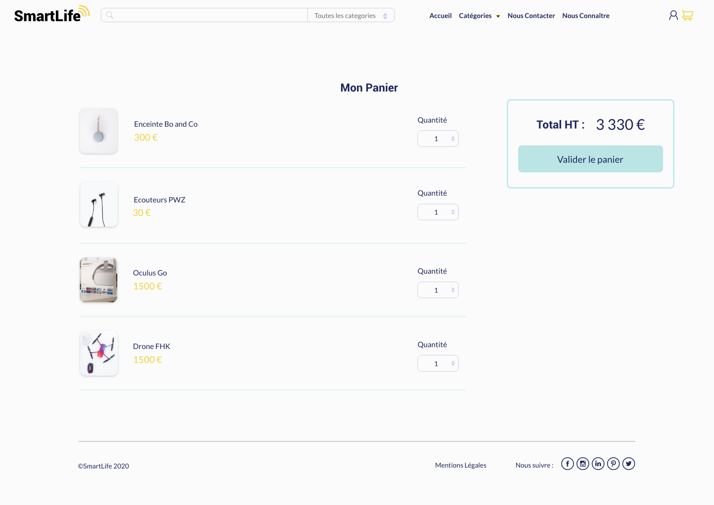

# SmartLife  
**Description :**  
SmartLife est un site de e-commerce. C'est un projet collectif créé pendant la formation Concepteur Développeur d'Applications. 
Au debut de la création de ce projet, nous avont conçu de la base de donné en adoptant la mèthode Merise. Nous avont également utilisé l'UML et les diagrammes. La partie development s'effectuait avec Symfony.   
  
**Mes tâches :** 
- participation à la création du schéma de base de données ( travail en group )
- creation de diagramme de classe
- creation du logo (Adobe Illustrator) et choix de la palette
- creation de la maquette desktop et mobile (Adobe XD)
- mise en place de la base de donne avec ORM Doctrine (à deux)
- intergation d'interfaces page d'accuiel, page mon compte, page connexion
- mise un place du fonctionalité authentification, changement des details du compte, affichage de produit sur la page d'acceuil

**Liens :**  
[Maquette desktop](https://xd.adobe.com/view/3ee2275a-c3db-435b-a949-d0bc45e7a3c0-6bb1/)  
[Maquette mobile](https://xd.adobe.com/view/5037430d-1ae9-484b-4cae-c1c5f98884fc-2606/)  

**Aperçu :**  
  
  
  
  
  
  
